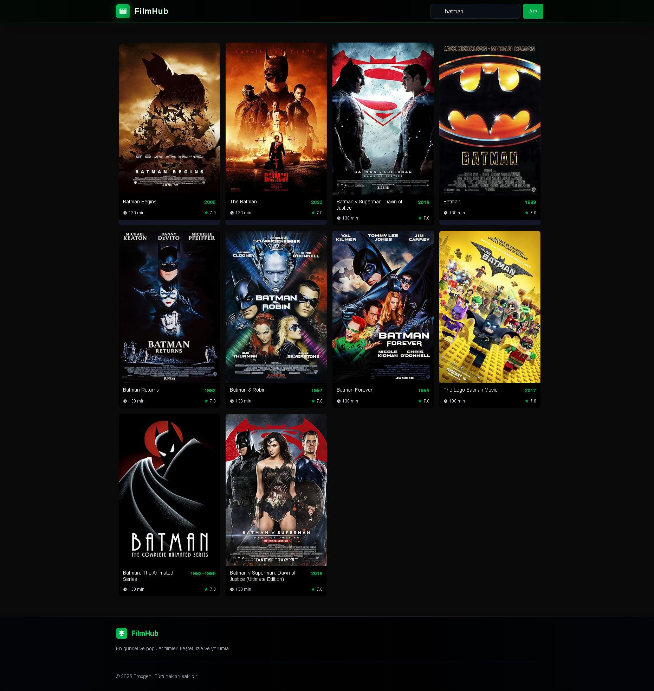
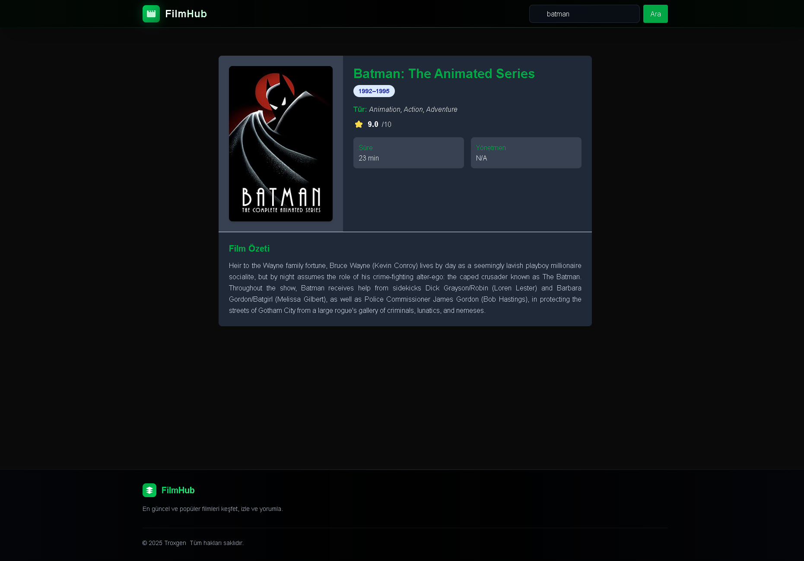

# 🎬 Next.js Film Hub

A modern, responsive and fast movie browser built with **Next.js 13**, powered by the **OMDb API**.  
Search movies, view posters, explore details like plot, rating, genre, and more — all in a sleek UI.

---

## 🌍 Available Languages

> Choose your preferred language below:

- 🇹🇷 [Türkçe README](./docs/README.tr.md) – Türkçe dökümantasyon
- 🇬🇧 [English README](./docs/README.en.md) – Full English documentation

---

## 📦 Quick Start

1. Clone the repo and install dependencies
2. Add your OMDb API key to `.env.local`
3. Run `npm run dev` and start searching movies

> Full setup instructions available in both language-specific README files.

---

## 📸 Screenshots

---

## 📬 Feedback & Contributions

Open issues, suggestions or pull requests are always welcome.  
Let’s build something better together.

